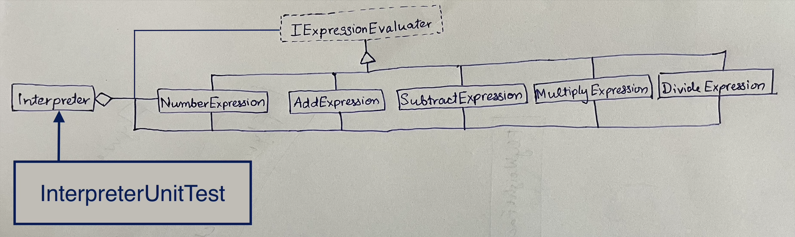

# Interpreter for arithmetic operations

## Overview
**Interpreter design pattern** is demonstrated in this project. The Interpreter pattern is a behavioural pattern. The intent of the design pattern is to, given a language, define a represention for its grammar along with an interpreter that uses the representation to interpret sentences in the language.

## The interpreter for arithmetic operations
The interpreter can evaluate simple strings of arithmetic expressions in postfix format. 
- The interpreter can handle the binary operators `+`, `-`, `*`, and `/`.
- Only english script numbers are supported.
- Invalid inputs strings will be failed gracefully.

## Design

## Environment
The project builds and runs with Visual Studio Community 2022 when the required workloads are installed.

